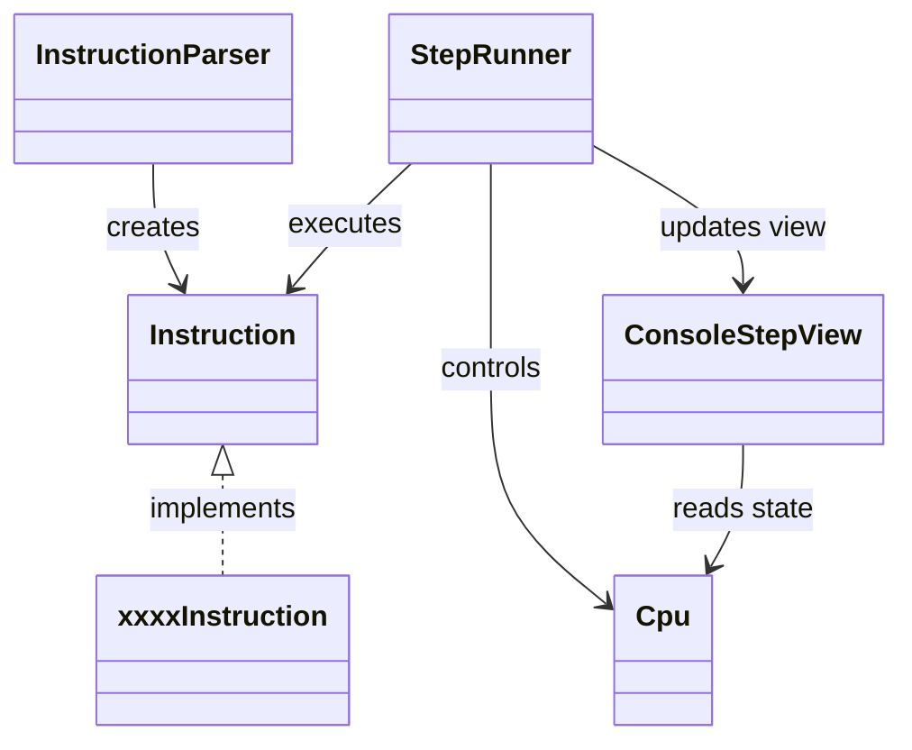

# MipsStepLab

Javaで実装した MIPSアセンブリの簡易シミュレータ兼ステップ実行デバッガです。

---

## アプリケーション概要

MIPS風のアセンブリコードを実行し、1命令ずつCPU内部の状態を可視化できるデバッガです。

命令の実行結果だけでなく、

- 命令の意味（イベント表示）
- レジスタ / メモリの差分
- PCの遷移

を同時に表示することで、アセンブリ言語の動作理解を支援します。

また、以下のような構成を持つことで、MIPSらしさを意識しています。

- メモリは `byte[]` で管理
- `byte / halfword / word` を命令側で構築
- `HI / LO` レジスタを実装

---

## 主な機能

### ステップ実行デバッガ
- Enterキーで1命令ずつ実行
- `run` による連続実行
- ブレークポイントで停止

### ブレークポイント
- `break <pc>` で設定
- `delete <pc>` で削除
- `clear` で全削除
- `breaks` で一覧表示

### 状態可視化
- レジスタ表示（差分付き）
- `HI / LO` 表示
- メモリ表示（0〜15）
- メモリ差分表示

### イベント表示
命令の意味を人間向けに表示します。

例:

```text
arithmetic: $t2 = $t0 + $t1
result: 15

load byte unsigned: $t2 = mem[10]
loaded value: 255

move from HI: $t0 = HI
value: 99
```

---

## 対応命令

### 算術
- add / addi / sub

### 乗算・除算
- mult / multu
- div / divu

### 論理
- and / or / xor / nor
- andi / ori / xori
- lui

### シフト
- sll / srl / sra
- sllv / srlv / srav

### 比較
- slt / slti / sltu / sltiu

### 分岐・ジャンプ
- beq / bne
- j / jal / jr / jalr
- bgez / blez / bgtz / bltz

### メモリアクセス
- lb / lbu / sb
- lh / lhu / sh
- lw / sw

### 特殊レジスタ転送
- mfhi / mflo
- mthi / mtlo

### 擬似命令
- move
- nop
- rem
- mul
- beqz / bnez
- b

※ 擬似命令は内部で既存命令へ展開、または同等処理で実装しています。


---

## 実行方法

### 全体
- Java 17 以上

### ビルド方法
```bash
./mvnw clean package
```

### テスト実行

```bash
./mvnw test
```

### アプリ起動

```bash
./mvnw compile
./mvnw exec:java -Dexec.mainClass=MSLMain
```

---

## 操作方法

| 入力 | 内容 |
|--------|------|
| Enter | 1ステップ実行 |
| run | 連続実行 |
| break <pc> | ブレークポイント追加 |
| delete <pc> | ブレークポイント削除 |
| clear | 全削除 |
| breaks | 一覧表示 |
| quit | 終了 |

---

## 設計

### 構成

| クラス | 役割 |
|--------|------|
| Cpu | レジスタ・メモリ・PC・HI/LO 管理 |
| Instruction | 命令インターフェース |
| InstructionParser | アセンブリ文字列から命令生成 |
| StepRunner | 実行制御 |
| ConsoleStepView | 表示処理 |

---

### クラス図



---

## 実装のポイント

- Interpreterパターンで命令をクラス化
- ポリモーフィズムによる命令実行
- StepRunner / ConsoleStepView の分離による責務分割
- 差分表示による状態変化の可視化
- byte配列によるメモリ表現
- HI / LO レジスタによる乗算・除算対応

---

## テスト

JUnit による単体テストを実装

- 命令単位テスト
- パーサテスト
- CPU動作テスト

---

## 今後の予定

- GUI対応またはWebアプリ化
- デバッガ機能の拡張
- 命令の追加

---

## 備考
本アプリは自己学習の目的で作成しており、実際のMIPS仕様のすべてを再現しているわけではありません。  