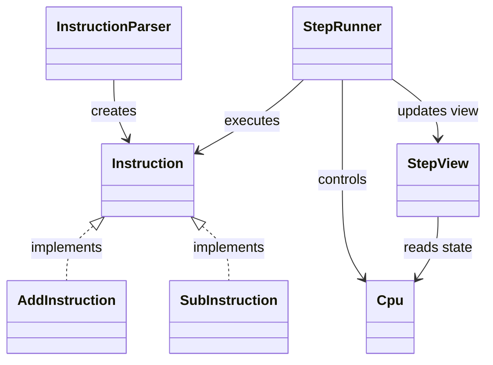

# MipsStepLab

Javaで実装した MIPSアセンブリの簡易シミュレータ兼ステップ実行デバッガです。

---

## アプリケーション概要

MIPS風のアセンブリコードを実行し、  
1命令ずつステップ実行しながら内部状態を可視化できるツールです。

以下の情報を毎ステップ表示します：

- 実行命令
- レジスタ状態
- メモリ状態
- 命令の意味（EVENT）
- レジスタ・メモリの差分
- 次に実行される命令

---

## 主な機能

### ステップ実行
- 1命令ごとの実行
- PCの遷移表示
- 次命令の表示

### レジスタ表示
- 主要レジスタの整形表示
- 実行前後の差分表示

### メモリ表示
- 指定範囲（0〜15）のメモリ表示
- メモリ変更差分の表示

### イベント表示
命令ごとの動作を人間が理解しやすい形で表示します。

#### 例：

```text
arithmetic: $t2 = $t0 + $t1
result: 15

logic: $t3 = $t0 | 5
result: 15

load word: $t0 = mem[4]
loaded value: 10

branch taken: beq matched
jump to: PC 8
```

---

## 対応命令

### 算術
- add
- addi
- sub

### 論理
- and
- or
- xor
- nor
- andi
- ori
- xori

### 比較
- slt
- slti

### 分岐・ジャンプ
- beq
- bne
- j
- jal
- jr

### メモリアクセス
- lw
- sw

---

## 設計

### 構成

| クラス | 役割 |
|--------|------|
| Cpu | レジスタ・メモリ管理 |
| Instruction | 命令インターフェース |
| InstructionParser | 命令の生成 |
| StepRunner | 実行制御 |
| StepView | 表示処理 |

---

### クラス図



---

## 実装のポイント
- Interpreterパターンをベースに命令をクラス化
- ポリモーフィズムによる命令実行
- 命令ごとのイベント表示
- レジスタ・メモリの差分表示

---

## 実行例

```text
STEP 3
PC      : 2
INSTR   : add $t2, $t0, $t1

EVENT
arithmetic: $t2 = $t0 + $t1
result: 15

CHANGES
$t2 : 0 -> 15
```

---

## 今後の予定
- slt / slti のイベント表示
- 命令の追加（mult, div など）
- ステップ実行機能の強化
- GUI対応

---

## 備考
本アプリは自己学習の目的で作成しており、実際のMIPS仕様のすべてを再現しているわけではありません。  