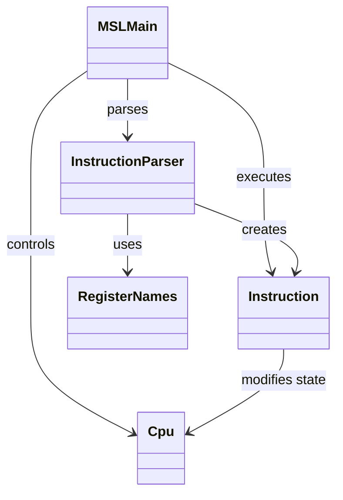

# MipsStepLab

MIPSアセンブリ言語の基本的な命令実行を学習するためにJavaで実装したCPUシミュレータです。  
アセンブリ文字列のパース、ラベル解決、分岐・ジャンプ命令、メモリ操作の実行を通して、CPUの動作とInterpreterパターンの理解を目的としています。  

## 現在の実装内容
- レジスタ32本の管理
- プログラムカウンタ（PC）
- 簡易メモリ（int配列によるword単位管理）
- PCに基づく命令フェッチと実行
- アセンブリ文字列のパース（2パス方式）
  - ラベル収集
  - 命令生成
- ラベルによる分岐・ジャンプ
- コメント除去（#）
- 実行ログの出力（PC・命令・レジスタ状態・ジャンプ検知）
- デバッグログの強化（レジスタとメモリの差分表示）
- テストコードの作成

## 命令
| 命令 | 内容 |
| ---- | ---- |
| li | レジスタに即値を代入（疑似命令）|
| add | レジスタ同士の加算 |
| addi | レジスタ + 即値 |
| sub | レジスタ同士の減算 |
| beq | 等しい場合に分岐 |
| bne | 等しくない場合に分岐 |
| j | 無条件ジャンプ |
| sw | レジスタの値をメモリへ書き込み |
| lw | メモリからレジスタへ書き込み |
| and | レジスタ同士のビットAND演算 |
| or | レジスタ同士のビットOR演算 |
| xor | レジスタ同士のビットXOR演算 |
| nor | レジスタ同士のビットNOR演算 |
| andi | レジスタと即値のAND演算 |
| ori | レジスタと即値のOR演算 |
| xori | レジスタと即値のXOR演算 |

## 対応している構文
```text
ラベル単独行
loop:

ラベル＋命令（同一行）
loop: addi $t0, $t0, -1

コメント
li $t0, 10 # 初期値
```

## パッケージ構成
```text
MSLMain

cpu/
├─ Cpu
└─ RegisterNames

instruction/
├─ Instruction
├─ LiInstruction
├─ AddInstruction
├─ AddiInstruction
├─ SubInstruction
├─ BeqInstruction
├─ BneInstruction
├─ SwInstruction
├─ LwInstruction
├─ JumpInstruction
├─ AndInstruction
├─ Ornstruction
├─ XorInstruction
└─ NorInstruction
└─ AndiInstruction
└─ OriInstruction
└─ XoriInstruction

parser/
└─ InstructionParser
```

## 全体構成図


## 設計のポイント
### ■ Interpreterパターン
Instruction：抽象構文（命令）  
各命令クラス：具体的な命令  
Cpu：コンテキスト（状態）  
execute()：命令の評価処理  

### ■ 2パスParser
1パス目：ラベルとPCの対応表を作成  
2パス目：命令オブジェクトを生成  
これにより、前方参照（後ろに定義されたラベル）にも対応しています。  

### ■ PC主導の実行モデル
for-eachではなくPCを基準に命令を取得することで、分岐・ジャンプを正しく扱える設計になっています。

### ■ メモリアクセス（簡略化）
- int[] によるword単位の簡易メモリ
- アドレスは base + offset で計算
- 実際のMIPSとは異なり、バイト単位ではなく配列インデックスとして扱う

## 今後の拡張予定（仮）

### ■ 命令セットの拡張
- シフト命令
  - `sll`, `srl`
- 比較命令
  - `slt`, `slti`
- 分岐命令の追加
  - `bgez`, `blez`, `bgtz`, `bltz`
- サブルーチン関連
  - `jal`, `jr`
- その他
  - `lui`
- メモリ命令の拡張
  - `lb`, `sb`, `lh`, `sh`
- 擬似命令
  - `move`, `nop` など
- 将来的に整数命令を一通り網羅
- 浮動小数点命令は後回し

---

### ■ パーサの強化
- 命令ごとの構文チェックの厳密化
- エラーメッセージの改善（行番号付き）
- ラベルの重複定義チェック
- ラベル名の妥当性検証
- 擬似命令の内部命令への展開
- `.data` / `.text` セクション対応
- データ定義ディレクティブ対応（`.word` など）

---

### ■ CPU / メモリモデルの強化
- byte単位のメモリ管理
- アラインメントの考慮
- 命令メモリとデータメモリの分離
- アドレス空間の整理
- 不正アクセス時の挙動定義
- HI / LO レジスタの対応
- 乗算・除算命令の追加

---

### ■ デバッグビューの強化
- `NEXT` セクションの独立表示
- 変更があったレジスタの強調表示
- 変更があったメモリの強調表示
- 表示対象レジスタの切り替え
- 表示対象メモリ範囲の切り替え
- 分岐成立 / 不成立の明示表示
- ステップ実行時の一時停止（Enterキー待ち）
- 実行ログのファイル出力

---

### ■ サンプルプログラムの充実
- 分岐専用サンプル
- メモリ専用サンプル
- ループ処理サンプル
- 全命令確認用サンプル
- 配列操作風サンプル
- 小規模アルゴリズム

---

### ■ 設計改善
- 命令クラスの共通化・整理
- 分岐命令の共通抽象化
- CLI表示ロジックの分離
- サンプル管理の分離
- Parserの責務分割
- GUI対応を見据えた構造改善

---

### ■ GUI化（将来）
- レジスタ一覧の表表示
- メモリ一覧の表表示
- 現在実行中の命令のハイライト
- ステップ実行ボタン
- 連続実行 / 停止機能
- ソースコード入力欄
- パースエラー表示
- 実行状態の可視化（PC・次命令など）

---

## 備考
本アプリは自己学習の目的で作成しており、実際のMIPS仕様のすべてを再現しているわけではありません。  