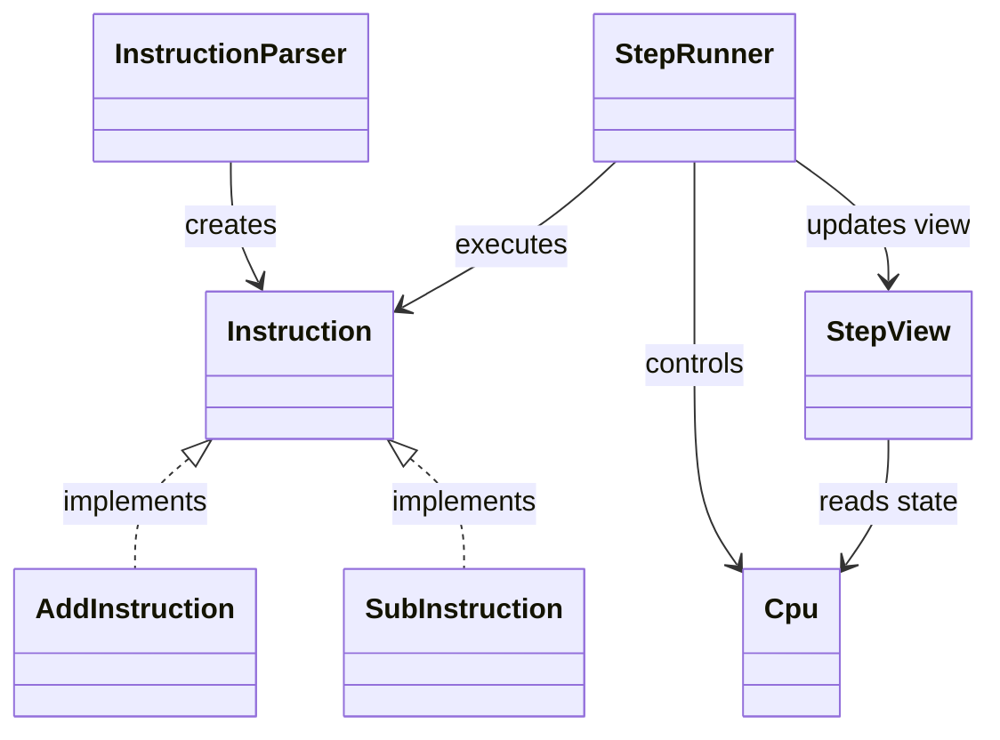

# MipsStepLab

Javaで実装した MIPSアセンブリの簡易シミュレータ兼ステップ実行デバッガです。

---

## アプリケーション概要

MIPS風のアセンブリコードを実行し、  
1命令ずつステップ実行しながらCPU内部の状態を可視化できるデバッガです。

命令の実行結果だけでなく、
「命令が何をしているのか」をイベントとして表示することで、
アセンブリの理解を支援します。  

メモリは byte 配列で保持し、word / halfword / byte 単位のアクセスを命令側で組み立てる構成にしています。

---

## 主な機能

### ステップ実行
- 1命令ごとの実行
- PCの遷移表示
- 次命令の表示

### レジスタ表示
- 主要レジスタの整形表示
- 実行前後の差分表示

### メモリ表示
- 指定範囲（0〜15）のメモリ表示
- メモリ変更差分の表示

### イベント表示
命令ごとの動作を人間が理解しやすい形で表示します。

#### 例：

```text
arithmetic: $t2 = $t0 + $t1
result: 15

logic: $t3 = $t0 | 5
result: 15

load word: $t0 = mem[4]
loaded value: 10

branch taken: beq matched
jump to: PC 8
```

---

## 対応命令

### 算術
- add
- addi
- sub

### 論理
- and
- or
- xor
- nor
- andi
- ori
- xori
- lui

### シフト
- sll
- srl
- sra
- sllv
- srlv

### 比較
- slt
- slti
- sltu
- sltiu

### 分岐・ジャンプ
- beq
- bne
- j
- jal
- jr

### メモリアクセス
- lb
- sb
- lh
- sh
- lw
- sw

---

## 設計

### 構成

| クラス | 役割 |
|--------|------|
| Cpu | レジスタ・メモリ管理 |
| Instruction | 命令インターフェース |
| InstructionParser | 命令の生成 |
| StepRunner | 実行制御 |
| StepView | 表示処理 |

---

### クラス図



---

## 実装のポイント
- Interpreterパターンをベースに命令をクラス化
- ポリモーフィズムによる命令分岐（execute）
- StepRunnerとStepViewの分離による責務分割
- 命令ごとのイベント表示による可視化
- レジスタ・メモリの差分表示による状態追跡

---

## 実行方法

```bash
javac MSLMain.java
java MSLMain
```

---

## 今後の予定
- 命令の追加（mult, div, シフト拡張など）
- ブレークポイント機能の追加
- ステップ実行機能の強化（run / step 切り替え）
- GUI対応

---

## 備考
本アプリは自己学習の目的で作成しており、実際のMIPS仕様のすべてを再現しているわけではありません。  