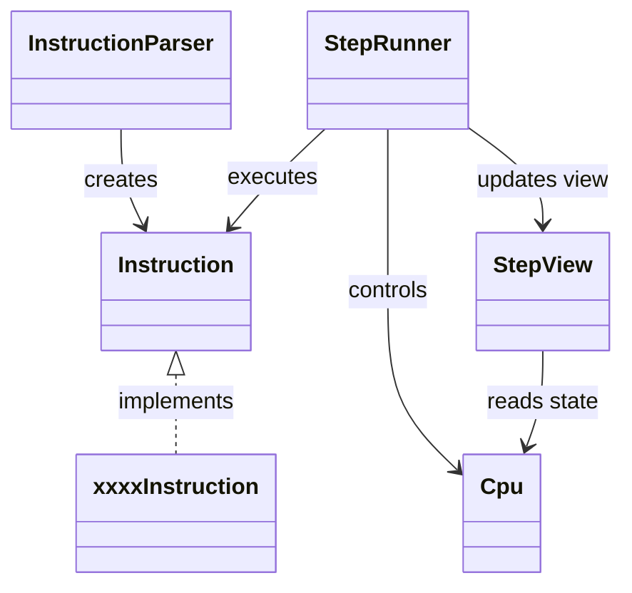

# MipsStepLab

Javaで実装した MIPSアセンブリの簡易シミュレータ兼ステップ実行デバッガです。

---

## アプリケーション概要

MIPS風のアセンブリコードを実行し、  
1命令ずつステップ実行しながら CPU 内部の状態を可視化できるデバッガです。

命令の実行結果だけでなく、  
「命令が何をしているのか」をイベントとして表示することで、  
アセンブリの理解を支援します。

メモリは `byte[]` で保持し、  
`byte / halfword / word` 単位のアクセスを命令側で組み立てる構成にしています。  
また、`HI / LO` の特殊レジスタも持ち、MIPSらしい構成を意識しています。

---

## 主な機能

### ステップ実行
- 1命令ごとの実行
- `run` / Enter による進行
- PC の遷移表示
- 次命令の表示

### レジスタ表示
- 主要レジスタの整形表示
- `HI / LO` を含む特殊レジスタ表示
- 実行前後の差分表示

### メモリ表示
- 指定範囲（0〜15）のメモリ表示
- メモリ変更差分の表示
- `byte[]` ベースのメモリ管理

### イベント表示
命令ごとの動作を人間が理解しやすい形で表示します。

例:

```text
arithmetic: $t2 = $t0 + $t1
result: 15

load byte unsigned: $t2 = mem[10]
loaded value: 255

shift: $t2 = $t3 >> $t4
result: -2

move from HI: $t0 = HI
value: 99
```

---

## 対応命令

### 算術
- add
- addi
- sub

### 乗算・除算
- mult
- multu
- div
- divu

### 論理
- and
- or
- xor
- nor
- andi
- ori
- xori
- lui

### シフト
- sll
- srl
- sra
- sllv
- srlv
- srav

### 比較
- slt
- slti
- sltu
- sltiu

### 分岐・ジャンプ
- beq
- bne
- j
- jal
- jr
- bgez
- blez
- bgtz
- bltz

### メモリアクセス
- lb
- lbu
- sb
- lh
- lhu
- sh
- lw
- sw

### 特殊レジスタ転送
- mfhi
- mflo

### 擬似命令
- move
- nop

※ 擬似命令は内部で既存命令へ展開して処理しています。  

---

## 設計

### 構成

| クラス | 役割 |
|--------|------|
| Cpu | レジスタ・メモリ・PC・HI/LO 管理 |
| Instruction | 命令インターフェース |
| InstructionParser | アセンブリ文字列から命令生成 |
| StepRunner | 実行制御 |
| StepView | 表示処理 |

---

### クラス図



---

## 実装のポイント
- Interpreterパターンをベースに命令をクラス化
- ポリモーフィズムによる命令分岐（`execute`）
- `StepRunner` と `StepView` の分離による責務分割
- 命令ごとのイベント表示による可視化
- レジスタ・メモリの差分表示による状態追跡
- `byte[]` メモリによる MIPS らしいメモリ表現
- `HI / LO` 導入による乗算・除算命令拡張への準備

---

## 実行方法

### テスト実行

```bash
mvn test
```

### アプリ起動

```bash
mvn compile
mvn exec:java -Dexec.mainClass=MSLMain
```

---

## テスト
JUnit による単体テストを実装しています。  
- 命令クラスごとのテスト
- InstructionParser のパーステスト
- CPU の動作テスト

---

## 今後の予定
- 命令の追加（随時issueに追加）
- ブレークポイント機能の追加
- ステップ実行機能の強化（run / step 切り替え）
- GUI対応

---

## 備考
本アプリは自己学習の目的で作成しており、実際のMIPS仕様のすべてを再現しているわけではありません。  