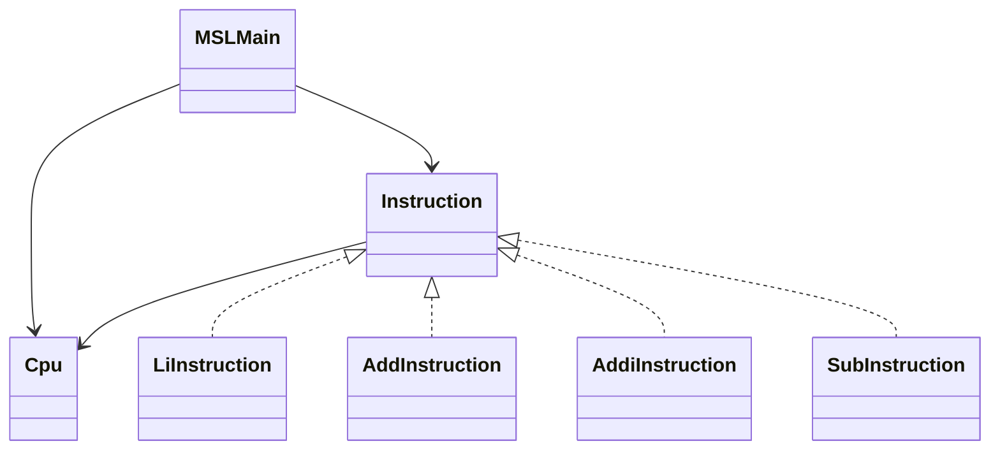

# MipsStepLab

MIPSアセンブリ言語の基本的な命令実行を学習するためにJavaで書いてみたCPUシミュレータです。

- MIPS命令の動作理解
- CPUの基本構造（レジスタ・PC）の理解
- Interpreterパターンの体験的理解

## 現在の実装内容
- レジスタ32本の管理
- プログラムカウンタ（PC）
- 命令を1つずつ順番に実行
- 実行ログの出力（PC・命令・レジスタ状態）

## 命令
| 命令 | 内容 |
| ---- | ---- |
| li | レジスタに即値を代入（疑似命令）|
| add | レジスタ同士の加算 |
| addi | レジスタ + 即値 |
| sub | レジスタ同士の減算 |

## 命令の例
```text
li $t0, 10
li $t1, 20
add $t2, $t0, $t1
addi $t2, $t2, 5
sub $t3, $t2, $t0
```

## アプリ実行の例
```text
PC = 0 : li $t0, 10
$t0 = 10

PC = 1 : li $t1, 20
$t1 = 20

PC = 2 : add $t2, $t0, $t1
$t2 = 30

PC = 3 : addi $t2, $t2, 5
$t2 = 35

PC = 4 : sub $t3, $t2, $t0
$t3 = 25
```

## クラス構成

