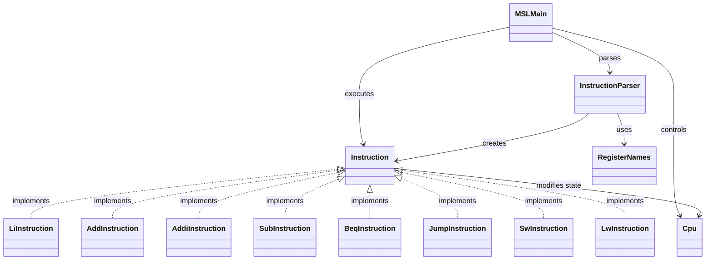

# MipsStepLab

MIPSアセンブリ言語の基本的な命令実行を学習するためにJavaで実装したCPUシミュレータです。  
アセンブリ文字列のパース、ラベル解決、分岐・ジャンプ命令の実行を通して、CPUの動作とInterpreterパターンの理解を目的としています。

## 現在の実装内容
- レジスタ32本の管理
- プログラムカウンタ（PC）
- PCに基づく命令フェッチと実行
- アセンブリ文字列のパース（2パス方式）
- ラベル収集
- 命令生成
- ラベルによる分岐・ジャンプ
- コメント除去（#）
- 実行ログの出力（PC・命令・レジスタ状態・ジャンプ検知）
- メモリ256wordの管理
- lw / sw（メモリ操作）

## 命令
| 命令 | 内容 |
| ---- | ---- |
| li | レジスタに即値を代入（疑似命令）|
| add | レジスタ同士の加算 |
| addi | レジスタ + 即値 |
| sub | レジスタ同士の減算 |
| beq | 条件成立時に指定ラベルまたはPCへ分岐 |
| j | 指令ラベルまたはPCへ無条件ジャンプ |
| sw | 指定のメモリへレジスタを書き込み |
| lw | 指定のメモリからレジスタを読み出し |

## 対応している構文
```text
ラベル単独行
loop:

ラベル＋命令（同一行）
loop: addi $t0, $t0, -1

コメント
li $t0, 10 # 初期値
```

## パッケージ構成
```text
MSLMain

cpu/
├─ Cpu
└─ RegisterNames

instruction/
├─ Instruction
├─ LiInstruction
├─ AddInstruction
├─ AddiInstruction
├─ SubInstruction
├─ BeqInstruction
├─ SwInstruction
├─ LwInstruction
└─ JumpInstruction

parser/
└─ InstructionParser
```

## クラス構成


## 設計のポイント
### ■ Interpreterパターン
Instruction：抽象構文（命令）  
各命令クラス：具体的な命令  
Cpu：コンテキスト（状態）  
execute()：命令の評価処理  

### ■ 2パスParser
1パス目：ラベルとPCの対応表を作成  
2パス目：命令オブジェクトを生成  
これにより、前方参照（後ろに定義されたラベル）にも対応しています。  

### ■ PC主導の実行モデル
for-eachではなくPCを基準に命令を取得することで、分岐・ジャンプを正しく扱える設計になっています。

## 今後の拡張予定
- bne
- ラベル構文の強化
- 実行ログの改善（差分表示）
- ステップ実行

## 備考
本アプリは自己学習の目的で作成しており、実際のMIPS仕様のすべてを再現しているわけではありません。  