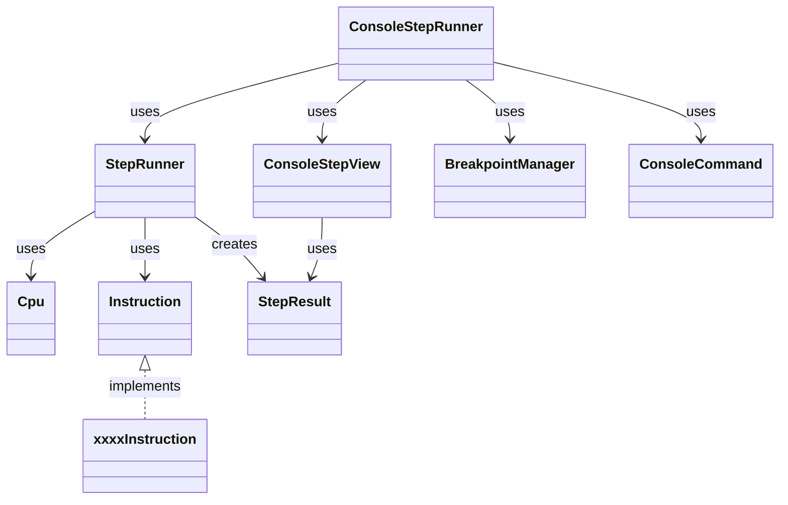
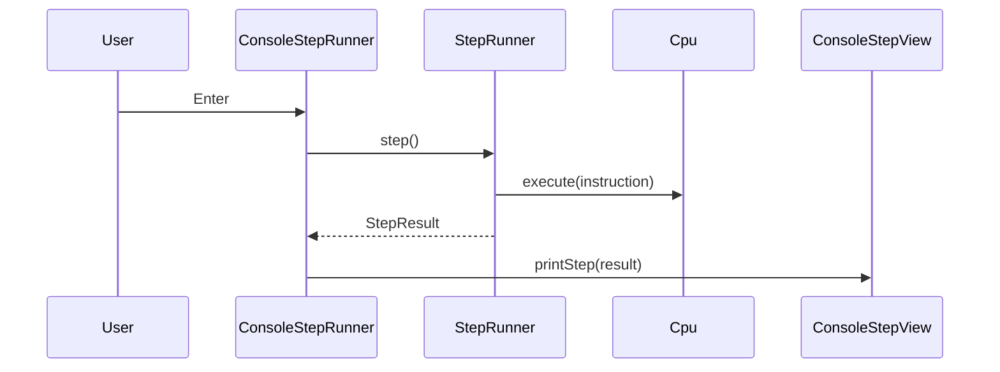

# MipsStepLab

MIPS命令を1ステップずつ実行しながら、  
レジスタやメモリの変化を確認できるデバッグツールです。

CUI（コンソール）上で動作し、  
命令ごとの状態変化を可視化することを目的としています。

将来的にはWebアプリ化を想定しており、  
実行処理と表示処理を分離した設計になっています。

---

## 主な機能

- MIPS命令のステップ実行
- レジスタの変更差分表示
- メモリの変更差分表示
- HI / LO レジスタの差分表示
- ブレークポイント機能
- runコマンドによる連続実行

---

## 対応命令

### 算術
- add / addi / sub

### 乗算・除算
- mult / multu
- div / divu

### 論理
- and / or / xor / nor
- andi / ori / xori
- lui

### シフト
- sll / srl / sra
- sllv / srlv / srav

### 比較
- slt / slti / sltu / sltiu

### 分岐・ジャンプ
- beq / bne
- j / jal / jr / jalr
- bgez / blez / bgtz / bltz

### メモリアクセス
- lb / lbu / sb
- lh / lhu / sh
- lw / sw

### 特殊レジスタ転送
- mfhi / mflo
- mthi / mtlo

### 擬似命令
- move
- nop
- rem
- mul
- beqz / bnez
- b

※ 擬似命令は内部で既存命令へ展開、または同等処理で実装しています。


---

## 実行方法

### 全体
- Java 17 以上

### ビルド方法
```bash
./mvnw clean package
```

### テスト実行

```bash
./mvnw test
```

### アプリ起動

```bash
./mvnw compile
./mvnw exec:java -Dexec.mainClass=MSLMain
```

---

## 操作方法

| 入力 | 内容 |
|--------|------|
| Enter | 1ステップ実行 |
| run | 連続実行 |
| break <pc> | ブレークポイント追加 |
| delete <pc> | ブレークポイント削除 |
| clear | ブレークポイント全削除 |
| breaks | ブレークポイント一覧表示 |
| quit | 終了 |

---

## パッケージ構成

```text
execution/
    StepRunner          // 命令を1ステップ実行する
    StepResult          // 1ステップ分の実行結果を保持
    BreakpointManager   // ブレークポイント管理

console/
    ConsoleStepRunner   // CUI操作（入力・コマンド処理）
    ConsoleStepView     // 実行結果の表示
    ConsoleCommand      // コマンド種別(enum)

cpu/
    Cpu                 // CPU本体

instruction/
    Instruction         // 命令インターフェース
    各命令クラス

parser/
    InstructionParser   // 命令解析
```

---

## クラス図



---

## シーケンス図（ステップ実行）



---

## 設計のポイント

### 1. 実行処理と表示処理の分離

- StepRunner：命令実行のみ担当
- ConsoleStepView：CUI表示のみ担当

これにより、Webアプリへの移行が容易になっています。

### 2. StepResultによるデータ受け渡し

1ステップの実行結果をオブジェクトとして保持することで、

- CUI表示
- Web表示

の両方に対応可能な設計にしています。

### 3. 責務の分離

- StepRunner：実行
- ConsoleStepRunner：操作制御
- BreakpointManager：状態管理

それぞれの役割を小さく分割しています。

---

## 今後の予定

- Webアプリ化 (Spring Boot)
- デバッガ機能の拡張
- 命令の追加

---

## 備考
本アプリは自己学習の目的で作成しており、実際のMIPS仕様のすべてを再現しているわけではありません。  