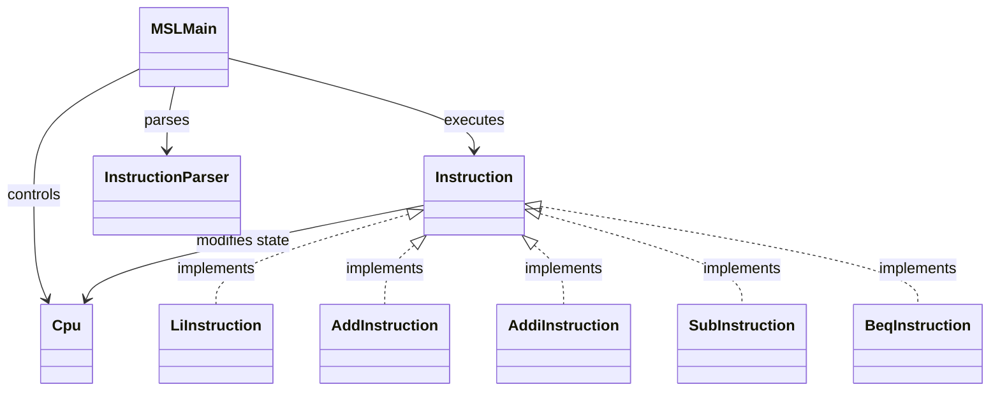

# MipsStepLab

MIPSアセンブリ言語の基本的な命令実行を学習するためにJavaで書いてみたCPUシミュレータです。

- MIPS命令の動作理解
- CPUの基本構造（レジスタ・PC）の理解
- プログラムカウンタによる命令制御の理解
- Interpreterパターンの体験的理解

## 現在の実装内容
- レジスタ32本の管理
- プログラムカウンタ（PC）
- PCに基づく命令フェッチ（逐次実行 / 分岐対応）
- アセンブリ文字列のパース（Parser）
- 実行ログの出力（PC・命令・レジスタ状態）
- ラベル対応（※現在は単独行のみ）
- コメント解析

## 命令
| 命令 | 内容 |
| ---- | ---- |
| li | レジスタに即値を代入（疑似命令）|
| add | レジスタ同士の加算 |
| addi | レジスタ + 即値 |
| sub | レジスタ同士の減算 |
| beq | 条件成立時に指定PCへ分岐 |

## 命令の例
```text
li $t0, 10
li $t1, 20
add $t2, $t0, $t1
addi $t2, $t2, 5
sub $t3, $t2, $t0
```

## アプリ実行の例
```text
PC = 0 : li $t0, 10
$t0 = 10

PC = 1 : li $t1, 20
$t1 = 20

PC = 2 : add $t2, $t0, $t1
$t2 = 30

PC = 3 : addi $t2, $t2, 5
$t2 = 35

PC = 4 : sub $t3, $t2, $t0
$t3 = 25
```

## パッケージ構成
```text
MSLMain

cpu/
├─ Cpu
└─ RegisterNames

instruction/
├─ Instruction
├─ LiInstruction
├─ AddInstruction
├─ AddiInstruction
├─ SubInstruction
└─ BeqInstruction

parser/
└─ InstructionParser
```

## クラス構成


## 設計のポイント
- Instruction：命令（式）
- 各命令クラス：具体的な式
- Cpu：コンテキスト（状態）
- execute()：interpret処理
- アセンブリ文字列から命令オブジェクトに変換

## 今後の拡張予定
- lw / sw（メモリ操作）
- 実行ログの改善（差分表示）
- ステップ実行
- テストコードの追加

## 備考
本アプリは自己学習の目的で作成しており、実際のMIPS仕様のすべてを再現しているわけではありません。  