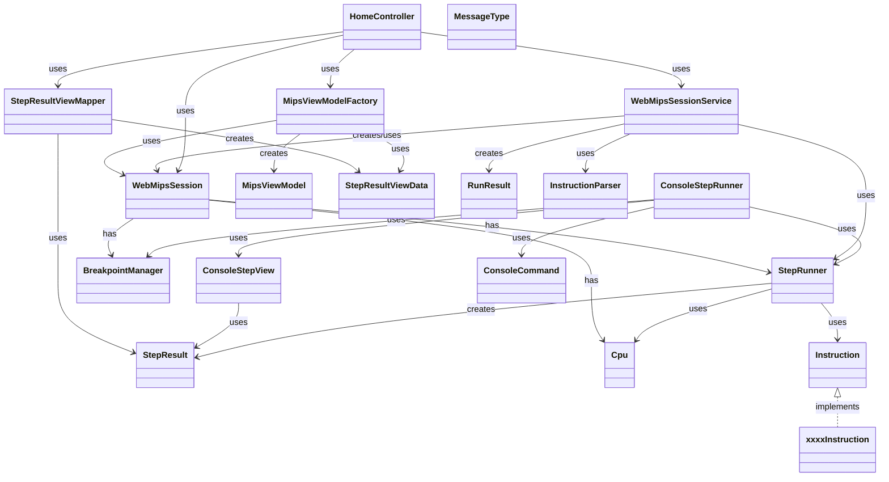
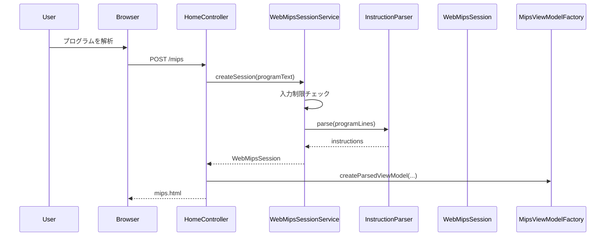
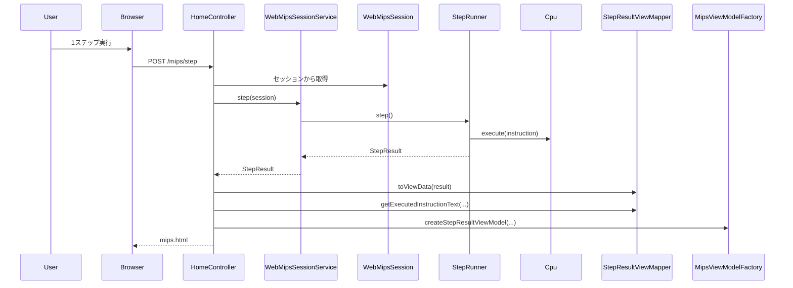
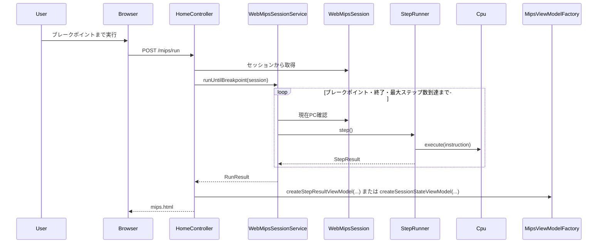

# MipsStepLab

MipsStepLabは、MIPS命令を1ステップずつ実行しながら、  
レジスタ・HI/LOレジスタ・メモリの変化を確認できる学習用ステップデバッガです。

現在は、Spring Bootを用いたWeb版を中心に開発しています。  
CUI版は、Web版を作る前にステップ実行ロジックやデバッガ機能を確認するためのデモ実装として残しています。

## 主な機能

### Web版

- ブラウザ上でのMIPSプログラム入力
- 入力プログラムのパース成功 / 失敗表示
- 1ステップ実行
- ブレークポイントの追加 / 削除
- ブレークポイントまたはプログラム終了までの連続実行
- 実行済み命令・次に実行される命令の表示
- ブレークポイント行の表示
- レジスタ差分表示
- レジスタ現在値一覧表示
- HI / LO 差分表示
- HI / LO 現在値表示
- メモリ差分表示
- メモリ現在値の簡易表示
- 変更されたレジスタ / HI・LO / メモリセルの強調表示
- HTTPセッションによる実行状態の保持
- run実行時の最大ステップ数制限
- 入力プログラムのサイズ制限
- フォーム送信後のスクロール位置保持
- ボタンの多重送信防止
- 2カラムレイアウトによるWeb画面表示
    - 左カラム：プログラム入力、解析・実行操作、プログラム一覧
    - 右カラム：CPU状態、最後の命令による変化
- カテゴリ別サンプルプログラムの選択・入力
- 入力欄とWeb実行状態のクリア
- レジスタ現在値の表形式表示
- HI / LO 現在値のカード表示
- メモリ現在値の表形式表示
- ラベル行・空行を考慮したプログラム一覧表示
- ラベル行はPCを持たず、命令行だけPCを持つ表示
- 最後に実行された1命令による変化の表示

### CUI版

- MIPS命令のステップ実行
- レジスタの変更差分表示
- メモリの変更差分表示
- HI / LO レジスタの差分表示
- ブレークポイント機能
- runコマンドによる連続実行

※ CUI版はWeb版開発前のデモ実装という位置づけです。

## 対応命令

### 算術

- add / addi / sub

### 乗算・除算

- mult / multu
- div / divu

### 論理

- and / or / xor / nor
- andi / ori / xori
- lui

### シフト

- sll / srl / sra
- sllv / srlv / srav

### 比較

- slt / slti / sltu / sltiu

### 分岐・ジャンプ

- beq / bne
- j / jal / jr / jalr
- bgez / blez / bgtz / bltz

### メモリアクセス

- lb / lbu / sb
- lh / lhu / sh
- lw / sw

### 特殊レジスタ転送

- mfhi / mflo
- mthi / mtlo

### 擬似命令

- move
- nop
- rem
- mul
- beqz / bnez
- b

※ 擬似命令は内部で既存命令へ展開、または同等処理で実装しています。

## 実行環境

- Java 21
- Maven Wrapper
- Spring Boot
- Thymeleaf

## ビルド方法

```bash
./mvnw clean package
```

Windows PowerShellの場合：

```bash
.\mvnw.cmd clean package
```

## テスト実行

```bash
./mvnw test
```

Windows PowerShellの場合：

```bash
.\mvnw.cmd test
```

### 主なテスト対象

- WebMipsSessionServiceTest
    - プログラム解析
    - 入力制限
    - ステップ実行
    - ブレークポイント追加 / 削除
    - run実行
    - 最大実行ステップ数制限
- StepResultViewMapperTest
    - レジスタ表示用データの作成
    - HI/LO表示用データの作成
    - メモリ表示用データの作成
    - 変更有無の changed 判定
    - 実行命令テキストの取得
- MipsViewModelFactoryTest
    - 初期表示用ViewModel生成
    - エラー表示用ViewModel生成
    - パース後ViewModel生成
    - セッション状態ViewModel生成
    - ステップ実行結果ViewModel生成
- HomeControllerTest
    - /mips の画面表示
    - プログラム解析
    - ステップ実行
    - run実行
    - リセット
    - ブレークポイント追加 / 削除
    - セッションなし・範囲外PCなどの異常系

## CUI版の起動方法

```bash
./mvnw compile
./mvnw exec:java -Dexec.mainClass=MSLMain
```

## Web版の起動方法

```bash
./mvnw spring-boot:run
```

起動後、ブラウザで以下にアクセスします。

```text
http://localhost:8080/mips
```

## Web版の操作方法

1. `/mips` にアクセスする
2. 必要に応じてサンプルプログラムを選択し、「サンプルを入力」を押す
3. または、テキストエリアにMIPSプログラムを直接入力する
4. 「プログラムを解析」を押す
5. パース成功後、「1ステップ実行」で命令を1つずつ実行する
6. 必要に応じて、プログラム一覧の `BP+` でブレークポイントを追加する
7. 「ブレークポイントまで実行」で、ブレークポイントまたはプログラム終了まで連続実行する
8. `BP-` でブレークポイントを削除できる
9. 「PC0からやり直す」で、同じプログラムを最初から実行し直す
10. 「入力欄をクリア」で、入力欄とWeb実行状態をクリアする

## Web版の画面構成

Web版は、情報を追いやすくするために2カラムレイアウトにしています。

### 左カラム

- プログラム入力
- サンプルプログラム選択
- プログラム解析
- 入力欄クリア
- ステップ実行
- ブレークポイントまで実行
- PC0からやり直し
- プログラム一覧
- ブレークポイント追加 / 削除

### 右カラム

- CPU状態
    - レジスタ現在値
    - HI / LO 現在値
    - メモリ現在値
- 最後の命令による変化
    - レジスタ差分
    - HI / LO 差分
    - メモリ差分

## Web版の表示ルール

### CPU状態

CPU状態では、現在のレジスタ・HI/LO・メモリの値を表示します。  
初期表示時点でも、レジスタ、HI/LO、メモリは0として表示します。  
レジスタとメモリは、8列×4行の表形式で表示します。

- レジスタ表
    - 行見出し：`+0`, `+8`, `+16`, `+24`
    - 列見出し：`+0`〜`+7`
    - セルには値のみ表示

- メモリ表
    - 行見出し：`+0`, `+8`, `+16`, `+24`
    - 列見出し：`+0`〜`+7`
    - セルには値のみ表示

HI/LOは、カード風の表示にしています。

### 変更値の強調表示

黄色で強調される値は、最後に実行された1命令で変化した値です。  
「ブレークポイントまで実行」を押した場合も、run全体で変化した値ではなく、最後に実行された1命令で変化した値だけを強調します。

### プログラム一覧

プログラム一覧では、textarea上の表示行と、実行対象命令のPCを分けて扱います。

- 命令行だけがPCを持つ
- ラベルだけの行はPCを持たない
- 空行もPCを持たない
- ラベル行にはブレークポイントボタンを表示しない

これにより、ラベル行や空行があるプログラムでも、PC表示がずれないようにしています。

## Web版の入力制限

Web版では、サーバー負荷を避けるため、入力プログラムに制限を設けています。

- 最大行数 (200)
- 1行の最大文字数 (200)
- 入力全体の最大文字数 (10,000)
- runの最大実行ステップ数 (1,000)

## パッケージ構成

```text
execution/
    StepRunner          // 命令を1ステップ実行する
    StepResult          // 1ステップ分の実行結果を保持
    BreakpointManager   // ブレークポイント管理

console/
    ConsoleStepRunner   // CUI操作（入力・コマンド処理）
    ConsoleStepView     // CUI実行結果の表示
    ConsoleCommand      // CUIコマンド種別(enum)

cpu/
    Cpu                 // CPU本体

instruction/
    Instruction         // 命令インターフェース
    各命令クラス

parser/
    InstructionParser   // 命令解析

web/
    MipsStepLabWebApplication // Spring Boot起動クラス
    HomeController            // Web画面のController
    WebMipsSession            // Web版の実行状態
    WebMipsSessionService     // Web版の実行・解析処理
    MipsViewModel             // Web画面に渡す表示用データ
    MipsViewModelFactory      // MipsViewModel生成
    StepResultViewMapper      // StepResultを画面表示用データへ変換
    StepResultViewData        // StepResult由来の表示用データ一式
    RunResult                 // run実行結果
    MessageType               // メッセージ種別
    RegisterDiff              // レジスタ差分表示用データ
    RegisterValue             // レジスタ現在値表示用データ
    HiLoDiff                  // HI/LO差分表示用データ
    HiLoValue                 // HI/LO現在値表示用データ
    MemoryDiff                // メモリ差分表示用データ
    MemoryValue               // メモリ現在値表示用データ
    ProgramLineView          // プログラム一覧の1行分の表示用データ

resources/
    templates/
        mips.html             // Web版画面テンプレート

    static/
        css/
            mips.css          // Web版CSS

        js/
            mips.js           // スクロール位置保持・多重送信防止
```

## クラス図


```mermaid
classDiagram

class StepRunner
class StepResult
class BreakpointManager

class ConsoleStepRunner
class ConsoleStepView
class ConsoleCommand

class HomeController
class WebMipsSession
class WebMipsSessionService
class MipsViewModel
class MipsViewModelFactory
class StepResultViewMapper
class StepResultViewData
class RunResult
class MessageType

class Cpu
class Instruction
class InstructionParser

StepRunner --> Cpu : uses
StepRunner --> Instruction : uses
StepRunner --> StepResult : creates

ConsoleStepRunner --> StepRunner : uses
ConsoleStepRunner --> ConsoleStepView : uses
ConsoleStepRunner --> BreakpointManager : uses
ConsoleStepRunner --> ConsoleCommand : uses
ConsoleStepView --> StepResult : uses

HomeController --> WebMipsSessionService : uses
HomeController --> StepResultViewMapper : uses
HomeController --> MipsViewModelFactory : uses
HomeController --> WebMipsSession : uses

WebMipsSessionService --> WebMipsSession : creates/uses
WebMipsSessionService --> InstructionParser : uses
WebMipsSessionService --> RunResult : creates
WebMipsSessionService --> StepRunner : uses

WebMipsSession --> Cpu : has
WebMipsSession --> StepRunner : has
WebMipsSession --> BreakpointManager : has

MipsViewModelFactory --> MipsViewModel : creates
MipsViewModelFactory --> WebMipsSession : uses
MipsViewModelFactory --> StepResultViewData : uses

StepResultViewMapper --> StepResult : uses
StepResultViewMapper --> StepResultViewData : creates

Instruction <|.. xxxxInstruction : implements
```

## シーケンス図（プログラム解析）


```mermaid
sequenceDiagram

participant User
participant Browser
participant HomeController
participant WebMipsSessionService
participant InstructionParser
participant WebMipsSession
participant MipsViewModelFactory

User ->> Browser : プログラムを解析
Browser ->> HomeController : POST /mips
HomeController ->> WebMipsSessionService : createSession(programText)
WebMipsSessionService ->> WebMipsSessionService : 入力制限チェック
WebMipsSessionService ->> InstructionParser : parse(programLines)
InstructionParser -->> WebMipsSessionService : instructions
WebMipsSessionService -->> HomeController : WebMipsSession
HomeController ->> MipsViewModelFactory : createParsedViewModel(...)
HomeController -->> Browser : mips.html
```

## シーケンス図（ステップ実行）


```mermaid
sequenceDiagram

participant User
participant Browser
participant HomeController
participant WebMipsSessionService
participant WebMipsSession
participant StepRunner
participant Cpu
participant StepResultViewMapper
participant MipsViewModelFactory

User ->> Browser : 1ステップ実行
Browser ->> HomeController : POST /mips/step
HomeController ->> WebMipsSession : セッションから取得
HomeController ->> WebMipsSessionService : step(session)
WebMipsSessionService ->> StepRunner : step()
StepRunner ->> Cpu : execute(instruction)
StepRunner -->> WebMipsSessionService : StepResult
WebMipsSessionService -->> HomeController : StepResult
HomeController ->> StepResultViewMapper : toViewData(result)
HomeController ->> StepResultViewMapper : getExecutedInstructionText(...)
HomeController ->> MipsViewModelFactory : createStepResultViewModel(...)
HomeController -->> Browser : mips.html
```

## シーケンス図（run実行）


```mermaid
sequenceDiagram

participant User
participant Browser
participant HomeController
participant WebMipsSessionService
participant WebMipsSession
participant StepRunner
participant Cpu
participant MipsViewModelFactory

User ->> Browser : ブレークポイントまで実行
Browser ->> HomeController : POST /mips/run
HomeController ->> WebMipsSession : セッションから取得
HomeController ->> WebMipsSessionService : runUntilBreakpoint(session)

loop ブレークポイント・終了・最大ステップ数到達まで
    WebMipsSessionService ->> WebMipsSession : 現在PC確認
    WebMipsSessionService ->> StepRunner : step()
    StepRunner ->> Cpu : execute(instruction)
    StepRunner -->> WebMipsSessionService : StepResult
end

WebMipsSessionService -->> HomeController : RunResult
HomeController ->> MipsViewModelFactory : createStepResultViewModel(...) または createSessionStateViewModel(...)
HomeController -->> Browser : mips.html
```

## 設計のポイント

### 実行処理と表示処理の分離

StepRunner は、命令を1ステップ実行して StepResult を返すことに集中しています。  
CUI表示やWeb表示の詳細は、別のクラスに分離しています。

- ConsoleStepView：CUI表示
- StepResultViewMapper：Web画面表示用データへの変換

### StepResultによるデータ受け渡し

1ステップの実行結果を StepResult として保持しています。  
StepResult には、以下のような情報を持たせています。

- 実行前PC
- 実行後PC
- 実行した命令
- 実行前後のレジスタ
- 実行前後のHI / LO
- 実行前後のメモリ

これにより、CUIとWebの両方で同じ実行結果を利用できます。

### Web版ではHTTPセッションで実行状態を保持

Webアプリでは、ボタンを押すたびに別のHTTPリクエストになります。  
そのため、CPU・命令列・StepRunner・ブレークポイント・実行済みPCを WebMipsSession にまとめ、HTTPセッションに保存しています。

### Serviceによる処理の分離

HomeController は、リクエストの受付と画面表示に集中します。  
プログラムの解析、実行状態の作成、ステップ実行、run実行などは WebMipsSessionService に分離しています。

### ViewModelによる画面表示データの整理

Web画面に渡す情報は MipsViewModel にまとめています。  
HomeController から多数の Model.addAttribute(...) を直接呼ぶのではなく、  
MipsViewModelFactory で画面表示用データを生成し、Thymeleaf側では viewModel.xxx として参照します。

### BuilderによるViewModel生成

MipsViewModel は表示項目が多いため、Builderパターンで生成しています。  
これにより、コンストラクタ引数の順番ミスを避け、どの値を設定しているかを読みやすくしています。

### Web表示用データへの変換

StepResultViewMapper で、StepResult からWeb画面用のデータを作成しています。  

例：
- RegisterDiff
- RegisterValue
- HiLoDiff
- HiLoValue
- MemoryDiff
- MemoryValue

さらに、これらを StepResultViewData にまとめて扱うことで、Controller側の処理を簡潔にしています。

### JavaScriptによる操作性改善

mips.js では、画面操作を補助しています。

- フォーム送信後のスクロール位置保持
- ボタンの多重送信防止
- 送信中ボタンの無効化

これにより、BP追加・削除やステップ実行後も、画面位置が大きく戻らないようにしています。

### ProgramLineViewによる表示行とPCの分離

textarea上の行番号と、実行対象命令のPCは必ずしも一致しません。  
たとえば、ラベル行や空行は画面には表示しますが、実行対象命令ではないためPCを持ちません。  
そのため、Web画面のプログラム一覧では ProgramLineView を使い、以下を分けて管理しています。

- textarea上の行番号
- 実行対象命令のPC
- 表示するプログラム行
- 命令行かどうか

これにより、ラベル行や空行がある場合でも、現在PC、実行済み行、ブレークポイント表示がずれにくくなります。

## 今後の予定

- サンプルプログラムの動作確認と調整
    - 各カテゴリのサンプルが解析・実行できることを確認する
    - ラベル行や空行がある場合のPC表示を確認する
    - 初学者が意味を追いやすい長さ・内容に調整する
- Controller周りのテスト追加
    - `/mips/clear` のテスト追加
    - クリア後にセッション状態が削除されることの確認
    - クリア後のViewModelが初期状態になることの確認
- ProgramLineView周りのテスト追加
    - 空行はPCを持たないこと
    - 空白だけの行はPCを持たないこと
    - 複数ラベル行があってもPCがずれないこと
    - ラベル行の前後に空行があってもPCがずれないこと
- CSSの整理
    - 使わなくなったCSSクラスの削除
    - レジスタ表とメモリ表の共通化検討
- 実行命令表示の設計改善
    - 現在は入力行を使って実行命令を表示しているため、よりよい設計を検討する
    - Instruction#toString() または表示用クラスの整理を検討する
- メモリ表示の改善
    - 表示範囲の切り替え
    - 10進数 / 16進数表示の切り替え
    - アドレス表示形式の改善
- レジスタ表示の改善
    - `$t0`, `$s0` などの別名表示
    - 10進数 / 16進数表示の切り替え
- サンプルプログラム説明の追加
    - サンプル選択時に簡単な説明を表示する
- 公開前の負荷対策
    - セッション数増加時のメモリ使用量確認
    - セッションタイムアウト確認
    - リクエスト制限の検討

# 備考

本アプリは自己学習の目的で作成しており、実際のMIPS仕様のすべてを再現しているわけではありません。