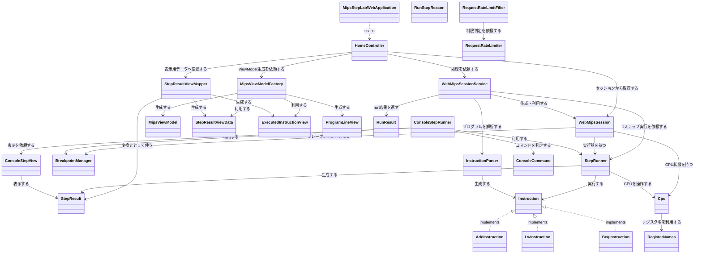
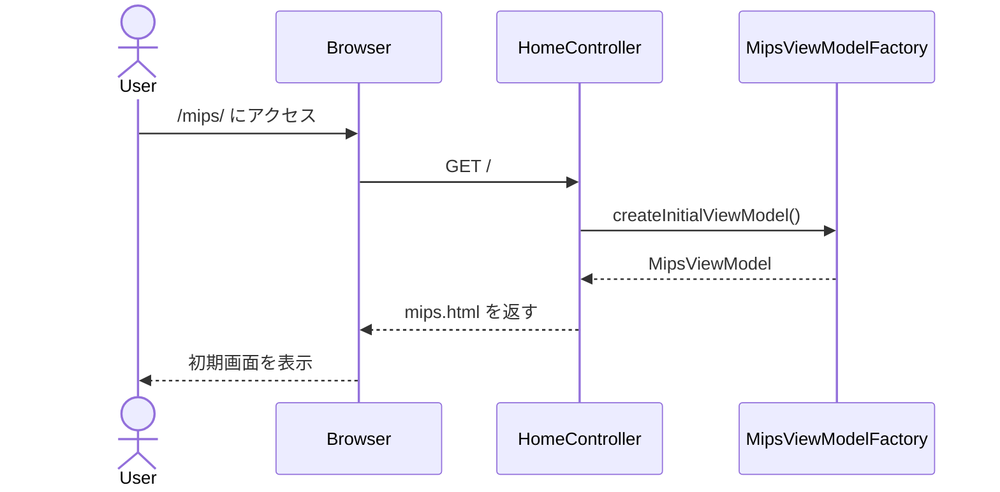
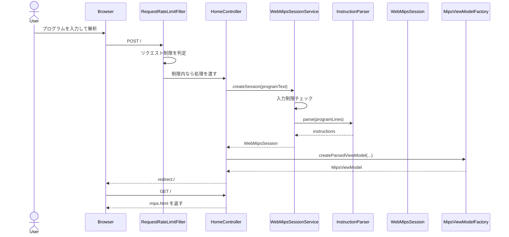
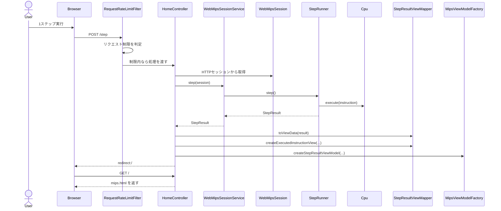
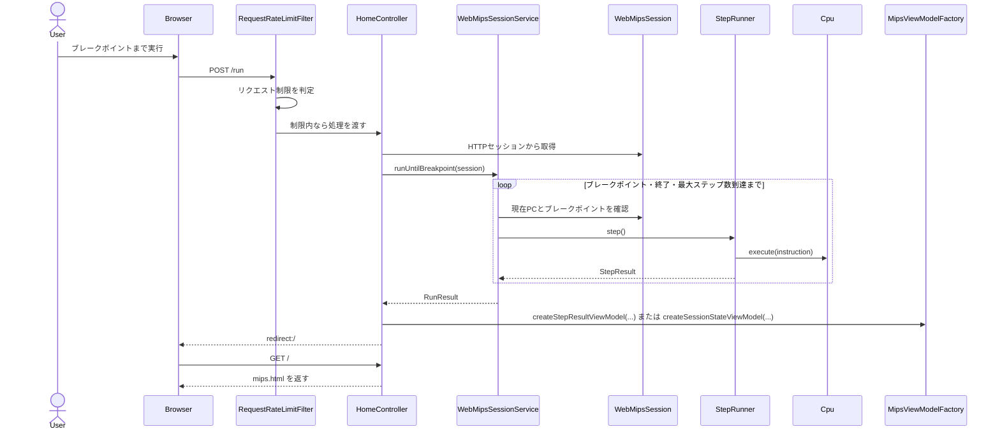

# MipsStepLab

## ■ 概要

MipsStepLabは、MIPS命令を1ステップずつ実行しながら、レジスタ・HI/LOレジスタ・メモリの変化を確認できる学習用ステップデバッガです。

ブラウザ上でMIPSプログラムを入力し、プログラム解析、1ステップ実行、ブレークポイントまでの連続実行、レジスタ・メモリ差分の確認を行えます。  
Spring Boot / Thymeleaf / JavaScriptを使い、HTTPセッションでCPU状態を保持しながら、ステップ実行の結果を画面に表示しています。

現在は、Spring Bootを用いたWeb版を中心に開発しています。  
開発初期に作成したCUI版も、ステップ実行ロジックやデバッガ機能を確認するための参考実装として残しています。

本アプリは自己学習の目的で作成しており、実際のMIPS仕様のすべてを再現しているわけではありません。

## ■ 公開URL

Web版を以下のURLで公開しています。  
https://mkunori.com/mips/

## ■ 使い方

本アプリは、PCブラウザでの利用を主に想定しています。  
スマートフォンなどの小さい画面では、表示や操作がしづらい場合があります。

公開URLにアクセスし、画面上の入力欄やボタンからMIPSプログラムを操作できます。

1. 必要に応じてサンプルプログラムを選択し、「サンプルを入力」を押す
2. または、テキストエリアにMIPSプログラムを直接入力する
3. 「プログラムを解析」を押す
4. パース成功後、「1ステップ実行」で命令を1つずつ実行する
5. 必要に応じて、プログラム一覧の `BP+` でブレークポイントを追加する
6. 「ブレークポイントまで実行」で、ブレークポイントまたはプログラム終了まで連続実行する
7. `BP-` でブレークポイントを削除できる
8. 「PC0からやり直す」で、同じプログラムを最初から実行し直す
9. 「入力欄をクリア」で、入力欄とWeb実行状態をクリアする

## ■ 主な機能

### Web版

- ブラウザ上でのMIPSプログラム入力
- 入力プログラムのパース成功 / 失敗表示
- カテゴリ別サンプルプログラムの選択・入力
- サンプルプログラム選択時の説明表示
- 入力欄とWeb実行状態のクリア
- 2カラムレイアウトによるWeb画面表示
  - 左カラム：プログラム入力、解析・実行操作、プログラム一覧
  - 右カラム：CPU状態、最後の命令による変化
- 1ステップ実行
- ブレークポイントの追加 / 削除
- ブレークポイントまたはプログラム終了までの連続実行
- run停止理由の表示
  - 現在PCがブレークポイント
  - ブレークポイント到達
  - プログラム終了
  - 最大ステップ数到達
- 最大ステップ数到達時の警告表示
- 実行済み命令・次に実行される命令の表示
- ブレークポイント行の表示
- ラベル行を考慮したプログラム一覧表示
- ラベル行はPCを持たず、命令行だけPCを持つ表示
- プログラム一覧のラベル行表示改善
- 現在PC行が見える位置への自動スクロール
- 長い命令行の折り返し表示
- レジスタ現在値の表形式表示
- レジスタ別名の表示
  - 例：`R8 / $t0`, `R16 / $s0`, `R31 / $ra`
- HI / LO 現在値のカード表示
- メモリ現在値の表形式表示
- メモリ値の10進数 / 16進数表示切り替え
- メモリアドレス見出しの10進数 / 16進数表示切り替え
- メモリ表示範囲の切り替え
  - `0〜31`
  - `32〜63`
  - `64〜95`
- メモリ表の4バイト区切り表示
- 最後に実行された1命令による変化の表示
- レジスタ差分表示
- HI / LO 差分表示
- メモリ差分表示
- 変更されたレジスタ / HI・LO / メモリセルの強調表示
- HTTPセッションによる実行状態の保持
- POST後リロード対策
  - POST処理後はGET画面へリダイレクト
  - ブラウザ更新時のPOST再送信を抑制
- セッションタイムアウトの明示設定
- セッション単位の簡易リクエスト制限
- run実行時の最大ステップ数制限
- 入力プログラムのサイズ制限
- フォーム送信後のスクロール位置保持
- ボタンの多重送信防止

### Web版の画面構成

左カラムには、プログラム入力、サンプル選択、実行操作、プログラム一覧を表示します。  
右カラムには、CPU状態と最後の命令による変化を表示します。

CPU状態では、現在のレジスタ・HI/LO・メモリの値を表示します。  
初期表示時点でも、レジスタ、HI/LO、メモリは0として表示します。

黄色で強調される値は、最後に実行された1命令で変化した値です。  
「ブレークポイントまで実行」を押した場合も、run全体で変化した値ではなく、最後に実行された1命令で変化した値だけを強調します。

### CUI版

- MIPS命令のステップ実行
- レジスタの変更差分表示
- メモリの変更差分表示
- HI / LO レジスタの差分表示
- ブレークポイント機能
- runコマンドによる連続実行

CUI版は、Web版開発前のデモ実装という位置づけです。

## ■ 対応命令

### 算術

- add / addi / sub

### 乗算・除算

- mult / multu
- div / divu

### 論理

- and / or / xor / nor
- andi / ori / xori
- lui

### シフト

- sll / srl / sra
- sllv / srlv / srav

### 比較

- slt / slti / sltu / sltiu

### 分岐・ジャンプ

- beq / bne
- j / jal / jr / jalr
- bgez / blez / bgtz / bltz

### メモリアクセス

- lb / lbu / sb
- lh / lhu / sh
- lw / sw

### 特殊レジスタ転送

- mfhi / mflo
- mthi / mtlo

### 擬似命令

- move
- nop
- rem
- mul
- beqz / bnez
- b

擬似命令は、内部で既存命令へ展開、または同等処理で実装しています。

## ■ 技術構成

### Webアプリケーション

- Java
- Spring Boot
- Spring MVC
- Thymeleaf
- HTML / CSS
- JavaScript
  - sessionStorage を使ったスクロール位置復元
  - sessionStorage を使ったメモリ表示形式・表示範囲の保持
- Maven

### アプリケーション設計

- Controller / Service / ViewModel の分離
- CPU / Instruction / Parser / StepRunner の分離
- HTTPセッションによるCPU状態の保持
- StepResultによる1ステップ実行結果の受け渡し
- ViewModelによる画面表示データの整理
- BuilderパターンによるViewModel生成
- ProgramLineViewによる表示行とPCの分離
- ExecutedInstructionViewによる実行命令表示の整理
- RequestRateLimitFilterによる簡易リクエスト制限

### テスト

- JUnit
- MockMvc
- Spring Boot Test

## ■ 公開環境

このアプリは、さくらのVPS上にデプロイし、独自ドメインとHTTPSで公開しています。

```text
Browser
↓
HTTPS
↓
Nginx
↓
MipsStepLab Spring Boot Application : 18082
```

### 主な構成

- さくらのVPS
- Ubuntu Server
- OpenJDK
- Nginx
- systemd
- Let's Encrypt / Certbot

## ■ 負荷対策

公開環境で動作させるため、以下の最低限の負荷対策を行っています。

- Nginxで同一IPからの過剰なリクエストを制限
- アプリケーション側でセッション単位の簡易リクエスト制限を実装
- 入力プログラムのサイズ制限
  - 最大行数：200行
  - 1行の最大文字数：200文字
  - 入力全体の最大文字数：10,000文字
- run実行時の最大ステップ数制限：1,000ステップ
- HTTPセッションタイムアウト：30分
- POST後リロード対策
  - Post/Redirect/Get パターン
  - ブラウザ更新時のPOST再送信を抑制

短時間に操作が集中した場合は、HTTP `429 Too Many Requests` を返します。  
通常の学習用途では制限にかかりにくい設定にしていますが、ボタン連打などで短時間に大量のリクエストが発生した場合は、少し時間をおいてから再操作する必要があります。

## ■ テスト

このアプリでは、JUnit / MockMvc / Spring Boot Test を使ってテストを追加しています。

### 主なテスト内容

- Spring Bootアプリケーションの起動確認
- CPUの単体テスト
  - レジスタ操作
  - メモリ読み書き
  - 命令実行時のCPU状態変更
- 命令クラスの単体テスト
  - 算術命令
  - 論理命令
  - シフト命令
  - 比較命令
  - 分岐・ジャンプ命令
  - メモリアクセス命令
  - HI/LO命令
  - 擬似命令
- Parserのテスト
  - 命令文字列の解析
  - ラベル解析
  - 擬似命令の解析
- WebMipsSessionServiceのテスト
  - プログラム解析
  - 入力制限
  - ステップ実行
  - ブレークポイント追加 / 削除
  - run実行
  - 最大実行ステップ数制限
- StepResultViewMapperのテスト
  - レジスタ表示用データの作成
  - HI/LO表示用データの作成
  - メモリ表示用データの作成
  - 変更有無の changed 判定
  - 実行命令表示用データの生成
- MipsViewModelFactoryのテスト
  - 初期表示用ViewModel生成
  - エラー表示用ViewModel生成
  - パース後ViewModel生成
  - セッション状態ViewModel生成
  - ステップ実行結果ViewModel生成
  - ProgramLineView生成
- HomeControllerのテスト
  - 画面表示
  - プログラム解析
  - ステップ実行
  - run実行
  - リセット
  - 入力欄クリア
  - ブレークポイント追加 / 削除
  - セッションなし・範囲外PCなどの異常系
- 表示用データクラスのテスト
  - レジスタ別名表示
  - メモリ値の符号なし表示
  - メモリ値・アドレスの16進数表示
  - run停止理由
- 簡易リクエスト制限のテスト
  - 上限回数までは許可すること
  - 上限を超えると拒否すること
  - 時間幅を過ぎると再び許可すること
  - セッションごとに別々にカウントすること
  - context-pathありでも制限対象を判定できること

### テスト実行

```powershell
.\mvnw.cmd test
```

## ■ パッケージ構成

```text
src/main/java
├─ MSLMain.java                         // CUI版のエントリーポイント
├─ console
│  ├─ ConsoleCommand.java               // CUIコマンド種別
│  ├─ ConsoleStepRunner.java            // CUI操作、入力、コマンド処理
│  └─ ConsoleStepView.java              // CUI実行結果の表示
├─ cpu
│  ├─ Cpu.java                          // CPU本体、レジスタ、HI/LO、メモリを管理
│  └─ RegisterNames.java                // レジスタ番号と別名の対応を管理
├─ execution
│  ├─ BreakpointManager.java            // ブレークポイント管理
│  ├─ StepResult.java                   // 1ステップ分の実行結果を保持
│  └─ StepRunner.java                   // 命令を1ステップ実行する
├─ instruction
│  ├─ Instruction.java                  // 命令インターフェース
│  └─ 各命令クラス                       // add, lw, beq などの命令実装
├─ parser
│  └─ InstructionParser.java            // 命令文字列をInstructionへ変換する
└─ web
   ├─ MipsStepLabWebApplication.java    // Spring Bootアプリケーションのエントリーポイント
   ├─ HomeController.java               // Web画面のController
   ├─ WebMipsSession.java               // Web版の実行状態
   ├─ WebMipsSessionService.java        // Web版の解析・実行処理
   ├─ MipsViewModel.java                // Web画面に渡す表示用データ
   ├─ MipsViewModelFactory.java         // MipsViewModel生成
   ├─ StepResultViewMapper.java         // StepResultを画面表示用データへ変換
   ├─ StepResultViewData.java           // StepResult由来の表示用データ一式
   ├─ ExecutedInstructionView.java      // 実行命令情報の表示用データ
   ├─ ProgramLineView.java              // プログラム一覧の1行分の表示用データ
   ├─ RunResult.java                    // run実行結果
   ├─ RunStopReason.java                // run実行の停止理由
   ├─ MessageType.java                  // メッセージ種別
   ├─ RegisterDiff.java                 // レジスタ差分表示用データ
   ├─ RegisterValue.java                // レジスタ現在値表示用データ
   ├─ HiLoDiff.java                     // HI/LO差分表示用データ
   ├─ HiLoValue.java                    // HI/LO現在値表示用データ
   ├─ MemoryDiff.java                   // メモリ差分表示用データ
   ├─ MemoryValue.java                  // メモリ現在値表示用データ
   ├─ RequestRateLimiter.java           // セッション単位の簡易リクエスト制限
   └─ RequestRateLimitFilter.java       // MipsStepLabのPOST操作を制限するFilter

src/main/resources
├─ application.properties               // セッションタイムアウトなどの基本設定
├─ templates
│  └─ mips.html                         // Web版画面テンプレート
└─ static
   ├─ css
   │  └─ mips.css                       // Web版CSS
   └─ js
      └─ mips.js                        // Web画面操作補助

src/test/java
├─ cpu                                  // CPUの単体テスト
├─ instruction                          // 各命令クラスの単体テスト
├─ parser                               // InstructionParserのテスト
└─ web                                  // Web版Service、Controller、ViewModel、Filterのテスト
```

## ■ クラス図


```mermaid
classDiagram
    class MipsStepLabWebApplication
    class HomeController
    class WebMipsSessionService
    class WebMipsSession
    class MipsViewModelFactory
    class MipsViewModel
    class StepResultViewMapper
    class StepResultViewData
    class ExecutedInstructionView
    class ProgramLineView
    class RunResult
    class RunStopReason
    class RequestRateLimitFilter
    class RequestRateLimiter

    class StepRunner
    class StepResult
    class BreakpointManager
    class Cpu
    class RegisterNames
    class Instruction
    class InstructionParser

    class ConsoleStepRunner
    class ConsoleStepView
    class ConsoleCommand

    MipsStepLabWebApplication ..> HomeController : scans

    HomeController --> WebMipsSessionService : 処理を依頼する
    HomeController --> StepResultViewMapper : 表示用データへ変換する
    HomeController --> MipsViewModelFactory : ViewModel生成を依頼する
    HomeController --> WebMipsSession : セッションから取得する

    WebMipsSessionService --> InstructionParser : プログラムを解析する
    WebMipsSessionService --> WebMipsSession : 作成・利用する
    WebMipsSessionService --> StepRunner : 1ステップ実行を依頼する
    WebMipsSessionService --> RunResult : run結果を返す

    WebMipsSession --> Cpu : CPU状態を持つ
    WebMipsSession --> StepRunner : 実行器を持つ
    WebMipsSession --> BreakpointManager : ブレークポイントを持つ

    MipsViewModelFactory --> MipsViewModel : 生成する
    MipsViewModelFactory --> ProgramLineView : 生成する
    MipsViewModelFactory --> StepResultViewData : 利用する
    MipsViewModelFactory --> ExecutedInstructionView : 利用する

    StepResultViewMapper --> StepResult : 変換元として使う
    StepResultViewMapper --> StepResultViewData : 生成する
    StepResultViewMapper --> ExecutedInstructionView : 生成する

    StepRunner --> Cpu : CPUを操作する
    StepRunner --> Instruction : 実行する
    StepRunner --> StepResult : 生成する

    Cpu --> RegisterNames : レジスタ名を利用する
    InstructionParser --> Instruction : 生成する
    Instruction <|.. AddInstruction : implements
    Instruction <|.. LwInstruction : implements
    Instruction <|.. BeqInstruction : implements

    RequestRateLimitFilter --> RequestRateLimiter : 制限判定を依頼する

    ConsoleStepRunner --> StepRunner : 利用する
    ConsoleStepRunner --> ConsoleStepView : 表示を依頼する
    ConsoleStepRunner --> BreakpointManager : 利用する
    ConsoleStepRunner --> ConsoleCommand : コマンドを判定する
    ConsoleStepView --> StepResult : 表示する
```

## ■ シーケンス図

### 初期表示


```mermaid
sequenceDiagram
    actor User
    participant Browser
    participant Controller as HomeController
    participant Factory as MipsViewModelFactory

    User->>Browser: /mips/ にアクセス
    Browser->>Controller: GET /
    Controller->>Factory: createInitialViewModel()
    Factory-->>Controller: MipsViewModel
    Controller-->>Browser: mips.html を返す
    Browser-->>User: 初期画面を表示
```

### プログラム解析


```mermaid
sequenceDiagram
    actor User
    participant Browser
    participant Filter as RequestRateLimitFilter
    participant Controller as HomeController
    participant Service as WebMipsSessionService
    participant Parser as InstructionParser
    participant Session as WebMipsSession
    participant Factory as MipsViewModelFactory

    User->>Browser: プログラムを入力して解析
    Browser->>Filter: POST /
    Filter->>Filter: リクエスト制限を判定
    Filter->>Controller: 制限内なら処理を渡す
    Controller->>Service: createSession(programText)
    Service->>Service: 入力制限チェック
    Service->>Parser: parse(programLines)
    Parser-->>Service: instructions
    Service-->>Controller: WebMipsSession
    Controller->>Factory: createParsedViewModel(...)
    Factory-->>Controller: MipsViewModel
    Controller-->>Browser: redirect:/
    Browser->>Controller: GET /
    Controller-->>Browser: mips.html を返す
```

### ステップ実行


```mermaid
sequenceDiagram
    actor User
    participant Browser
    participant Filter as RequestRateLimitFilter
    participant Controller as HomeController
    participant Service as WebMipsSessionService
    participant Session as WebMipsSession
    participant Runner as StepRunner
    participant Cpu
    participant Mapper as StepResultViewMapper
    participant Factory as MipsViewModelFactory

    User->>Browser: 1ステップ実行
    Browser->>Filter: POST /step
    Filter->>Filter: リクエスト制限を判定
    Filter->>Controller: 制限内なら処理を渡す
    Controller->>Session: HTTPセッションから取得
    Controller->>Service: step(session)
    Service->>Runner: step()
    Runner->>Cpu: execute(instruction)
    Runner-->>Service: StepResult
    Service-->>Controller: StepResult
    Controller->>Mapper: toViewData(result)
    Controller->>Mapper: createExecutedInstructionView(...)
    Controller->>Factory: createStepResultViewModel(...)
    Controller-->>Browser: redirect:/
    Browser->>Controller: GET /
    Controller-->>Browser: mips.html を返す
```

### run実行


```mermaid
sequenceDiagram
    actor User
    participant Browser
    participant Filter as RequestRateLimitFilter
    participant Controller as HomeController
    participant Service as WebMipsSessionService
    participant Session as WebMipsSession
    participant Runner as StepRunner
    participant Cpu
    participant Factory as MipsViewModelFactory

    User->>Browser: ブレークポイントまで実行
    Browser->>Filter: POST /run
    Filter->>Filter: リクエスト制限を判定
    Filter->>Controller: 制限内なら処理を渡す
    Controller->>Session: HTTPセッションから取得
    Controller->>Service: runUntilBreakpoint(session)

    loop ブレークポイント・終了・最大ステップ数到達まで
        Service->>Session: 現在PCとブレークポイントを確認
        Service->>Runner: step()
        Runner->>Cpu: execute(instruction)
        Runner-->>Service: StepResult
    end

    Service-->>Controller: RunResult
    Controller->>Factory: createStepResultViewModel(...) または createSessionStateViewModel(...)
    Controller-->>Browser: redirect:/
    Browser->>Controller: GET /
    Controller-->>Browser: mips.html を返す
```

## ■ CUI版について

本リポジトリには、Web版の前段階として作成したCUI版も含めています。

CUI版では、MIPS命令のステップ実行、レジスタ差分表示、メモリ差分表示、HI/LO差分表示、ブレークポイント、runコマンドを実装しました。  
その後、同じ実行ロジックをSpring Boot版へ発展させ、ブラウザ上で操作できるステップデバッガとして整理しています。

現在のメイン実装はSpring Boot版です。  
CUI版は、開発経緯と学習過程を示す参考実装として残しています。

## ■ 学習ポイント

このプロジェクトでは、MIPS命令シミュレータを題材に、命令解析、CPU状態管理、ステップ実行、Webアプリケーション化、VPS公開までを実践しました。

### MIPS命令シミュレータ

- 命令インターフェースによる各命令クラスの分離
- レジスタ、HI/LO、メモリを持つCpuクラスの設計
- InstructionParserによる文字列から命令オブジェクトへの変換
- ラベル解析と分岐・ジャンプ命令の実装
- StepRunnerによる1命令ずつの実行制御
- StepResultによる実行前後の差分管理
- ブレークポイント管理

### Webアプリケーション開発

- Spring BootによるWebアプリケーション構築
- Controller / Service / ViewModel の責務分離
- Thymeleafによる画面表示
- HTTPセッションを使った実行状態の保持
- Post/Redirect/Get パターンによるPOST再送信対策
- JavaScriptによるスクロール位置復元、表示切り替え、ボタン多重送信防止
- MockMvcによるControllerテスト

### 表示・UI設計

- 2カラムレイアウトによる入力・状態表示の整理
- レジスタ・メモリの表形式表示
- メモリの10進数 / 16進数表示切り替え
- メモリ表示範囲の切り替え
- ラベル行と命令行の表示分離
- 最後に実行された1命令の差分強調

### 公開・運用

- VPS上でのSpring Bootアプリケーション公開
- Nginxによるリバースプロキシ設定
- systemdによるJavaアプリケーションのサービス化
- 独自ドメインとLet's Encrypt / CertbotによるHTTPS化
- context-pathを使った複数Webアプリのパス分離
- Nginxとアプリケーション側の簡易的な負荷対策

## ■ 今後改善していくならば

### アプリケーション機能

- 命令の追加
- サンプルプログラムの追加
- 実行命令表示のさらなる整理

### 画面表示

- スマートフォン表示の調整
- メモリ表示のさらなる改善
- エラー表示の改善

### コード設計・テスト

- `Instruction#toString()` または表示用InstructionViewの検討
- Controller層の異常系テスト追加
- Parser周りのテスト拡充
