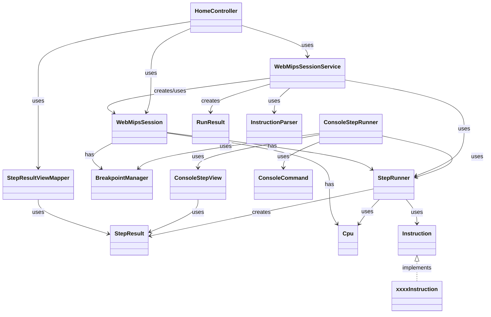
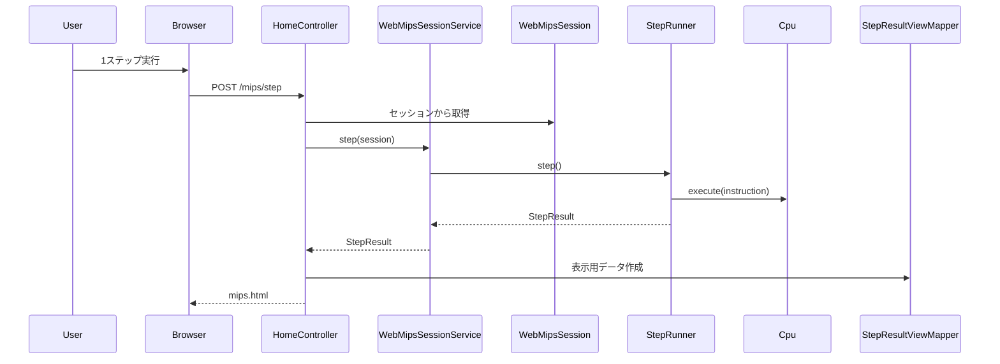
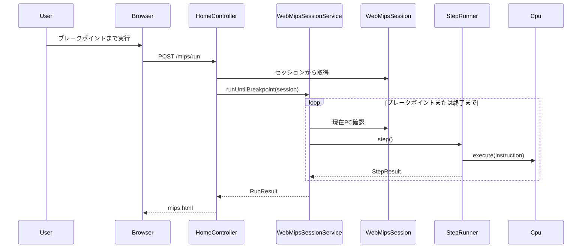

# MipsStepLab

MipsStepLabは、MIPS命令を1ステップずつ実行しながら、  
レジスタ・HI/LOレジスタ・メモリの変化を確認できる学習用デバッグツールです。

CUI（コンソール）版に加えて、Spring Bootを用いたWeb版も実装しています。  
実行処理と表示処理を分離し、同じステップ実行ロジックをCUIとWebの両方から利用できる構成を目指しています。

## 主な機能

### CUI版

- MIPS命令のステップ実行
- レジスタの変更差分表示
- メモリの変更差分表示
- HI / LO レジスタの差分表示
- ブレークポイント機能
- runコマンドによる連続実行

### Web版

- ブラウザ上でのMIPSプログラム入力
- 入力プログラムのパース成功 / 失敗表示
- 1ステップ実行
- ブレークポイントの追加 / 削除 / 一覧表示
- ブレークポイントまたはプログラム終了までの連続実行
- 実行済み命令・次に実行される命令の表示
- レジスタ差分表示
- レジスタ現在値一覧表示
- HI / LO 差分表示
- HI / LO 現在値表示
- メモリ差分の簡易表示
- HTTPセッションによる実行状態の保持
- run実行時の最大ステップ数制限
- 入力プログラムのサイズ制限

## 対応命令

### 算術

- add / addi / sub

### 乗算・除算

- mult / multu
- div / divu

### 論理

- and / or / xor / nor
- andi / ori / xori
- lui

### シフト

- sll / srl / sra
- sllv / srlv / srav

### 比較

- slt / slti / sltu / sltiu

### 分岐・ジャンプ

- beq / bne
- j / jal / jr / jalr
- bgez / blez / bgtz / bltz

### メモリアクセス

- lb / lbu / sb
- lh / lhu / sh
- lw / sw

### 特殊レジスタ転送

- mfhi / mflo
- mthi / mtlo

### 擬似命令

- move
- nop
- rem
- mul
- beqz / bnez
- b

※ 擬似命令は内部で既存命令へ展開、または同等処理で実装しています。

## 実行環境

- Java 21
- Maven Wrapper
- Spring Boot
- Thymeleaf

## ビルド方法

```bash
./mvnw clean package
```

Windows PowerShellの場合：

```bash
.\mvnw.cmd clean package
```

## テスト実行

```bash
./mvnw test
```

Windows PowerShellの場合：

```bash
.\mvnw.cmd test
```

## CUI版の起動方法

```bash
./mvnw compile
./mvnw exec:java -Dexec.mainClass=MSLMain
```

Windows PowerShellの場合：

```bash
.\mvnw.cmd compile
.\mvnw.cmd exec:java -Dexec.mainClass=MSLMain
```

## Web版の起動方法

```bash
./mvnw spring-boot:run
```

Windows PowerShellの場合：

```bash
.\mvnw.cmd spring-boot:run
```

起動後、ブラウザで以下にアクセスします。

```text
http://localhost:8080/mips
```

## Web版の操作方法

1. /mips にアクセスする
2. テキストエリアにMIPSプログラムを入力する
3. 「プログラムを解析」を押す
4. パース成功後、「1ステップ実行」で命令を1つずつ実行する
5. 必要に応じてブレークポイントを追加する
6. 「ブレークポイントまで実行」で連続実行する
7. 「リセット」で同じプログラムを最初から実行し直す

## Web版の入力制限

Web版では、サーバー負荷を避けるため、入力プログラムに制限を設けています。

- 最大行数 (200)
- 1行の最大文字数 (200)
- 入力全体の最大文字数 (10,000)
- runの最大実行ステップ数 (1,000)

## パッケージ構成

```text
execution/
    StepRunner          // 命令を1ステップ実行する
    StepResult          // 1ステップ分の実行結果を保持
    BreakpointManager   // ブレークポイント管理

console/
    ConsoleStepRunner   // CUI操作（入力・コマンド処理）
    ConsoleStepView     // CUI実行結果の表示
    ConsoleCommand      // CUIコマンド種別(enum)

cpu/
    Cpu                 // CPU本体

instruction/
    Instruction         // 命令インターフェース
    各命令クラス

parser/
    InstructionParser   // 命令解析

web/
    MipsStepLabWebApplication // Spring Boot起動クラス
    HomeController            // Web画面のController
    WebMipsSession            // Web版の実行状態
    WebMipsSessionService     // Web版の実行・解析処理
    StepResultViewMapper      // StepResultを画面表示用データへ変換
    RunResult                 // run実行結果
    RegisterDiff              // レジスタ差分表示用データ
    RegisterValue             // レジスタ現在値表示用データ
    HiLoDiff                  // HI/LO差分表示用データ
    HiLoValue                 // HI/LO現在値表示用データ
    MemoryDiff                // メモリ差分表示用データ

resources/
    templates/
        mips.html             // Web版画面テンプレート

    static/
        css/
            mips.css          // Web版CSS
```

## クラス図


```mermaid
classDiagram

class StepRunner
class StepResult
class BreakpointManager

class ConsoleStepRunner
class ConsoleStepView
class ConsoleCommand

class WebMipsSession
class WebMipsSessionService
class StepResultViewMapper
class HomeController
class RunResult

class Cpu
class Instruction
class InstructionParser

StepRunner --> Cpu : uses
StepRunner --> Instruction : uses
StepRunner --> StepResult : creates

ConsoleStepRunner --> StepRunner : uses
ConsoleStepRunner --> ConsoleStepView : uses
ConsoleStepRunner --> BreakpointManager : uses
ConsoleStepRunner --> ConsoleCommand : uses

ConsoleStepView --> StepResult : uses

HomeController --> WebMipsSessionService : uses
HomeController --> StepResultViewMapper : uses
HomeController --> WebMipsSession : uses

WebMipsSessionService --> WebMipsSession : creates/uses
WebMipsSessionService --> InstructionParser : uses
WebMipsSessionService --> RunResult : creates
WebMipsSessionService --> StepRunner : uses

WebMipsSession --> Cpu : has
WebMipsSession --> StepRunner : has
WebMipsSession --> BreakpointManager : has

StepResultViewMapper --> StepResult : uses

Instruction <|.. xxxxInstruction : implements
```

## シーケンス図（Web版ステップ実行）


```mermaid
sequenceDiagram

participant User
participant Browser
participant HomeController
participant WebMipsSessionService
participant WebMipsSession
participant StepRunner
participant Cpu
participant StepResultViewMapper

User ->> Browser : 1ステップ実行
Browser ->> HomeController : POST /mips/step
HomeController ->> WebMipsSession : セッションから取得
HomeController ->> WebMipsSessionService : step(session)
WebMipsSessionService ->> StepRunner : step()
StepRunner ->> Cpu : execute(instruction)
StepRunner -->> WebMipsSessionService : StepResult
WebMipsSessionService -->> HomeController : StepResult
HomeController ->> StepResultViewMapper : 表示用データ作成
HomeController -->> Browser : mips.html
```

## シーケンス図（Web版run実行）


```mermaid
sequenceDiagram

participant User
participant Browser
participant HomeController
participant WebMipsSessionService
participant WebMipsSession
participant StepRunner
participant Cpu

User ->> Browser : ブレークポイントまで実行
Browser ->> HomeController : POST /mips/run
HomeController ->> WebMipsSession : セッションから取得
HomeController ->> WebMipsSessionService : runUntilBreakpoint(session)

loop ブレークポイントまたは終了まで
    WebMipsSessionService ->> WebMipsSession : 現在PC確認
    WebMipsSessionService ->> StepRunner : step()
    StepRunner ->> Cpu : execute(instruction)
    StepRunner -->> WebMipsSessionService : StepResult
end

WebMipsSessionService -->> HomeController : RunResult
HomeController -->> Browser : mips.html
```

## 設計のポイント

### 実行処理と表示処理の分離

StepRunner は、命令を1ステップ実行して StepResult を返すことに集中しています。  
CUI表示やWeb表示の詳細は、別のクラスに分離しています。

- ConsoleStepView：CUI表示
- StepResultViewMapper：Web画面表示用データへの変換

### StepResultによるデータ受け渡し

1ステップの実行結果を StepResult として保持しています。  
StepResult には、以下のような情報を持たせています。

- 実行前PC
- 実行後PC
- 実行した命令
- 実行前後のレジスタ
- 実行前後のHI / LO
- 実行前後のメモリ

これにより、CUIとWebの両方で同じ実行結果を利用できます。

### Web版ではHTTPセッションで実行状態を保持

Webアプリでは、ボタンを押すたびに別のHTTPリクエストになります。  
そのため、CPU・命令列・StepRunner・ブレークポイント・実行済みPCを WebMipsSession にまとめ、HTTPセッションに保存しています。

### Serviceによる処理の分離

HomeController は、リクエストの受付と画面表示に集中します。  
プログラムの解析、実行状態の作成、ステップ実行、run実行などは WebMipsSessionService に分離しています。

### Web表示用データへの変換

StepResultViewMapper で、StepResult からWeb画面用のデータを作成しています。  

例：
- RegisterDiff
- RegisterValue
- HiLoDiff
- HiLoValue
- MemoryDiff

これにより、実行処理と画面表示用データの加工処理を分離しています。

## 今後の予定

- 画面レイアウトの改善
    - 左側にプログラム入力・命令一覧・操作ボタンを配置
    - 右側にレジスタ一覧・HI/LO一覧・差分表示を配置
- メモリ表示の改善
    - 表形式でメモリ現在値を表示
    - 変更されたメモリセルを強調表示
    - 表示範囲の切り替え
- ブレークポイント操作の改善
    - 命令行からクリックで追加 / 削除
    - ブレークポイント行の強調表示
- Instruction#toString() または表示用クラスの整理
    - 実行命令の表示方法を改善
- エラーメッセージ / 成功メッセージの表示整理
- 命令の追加
- テストの追加・整理

# 備考

本アプリは自己学習の目的で作成しており、実際のMIPS仕様のすべてを再現しているわけではありません。